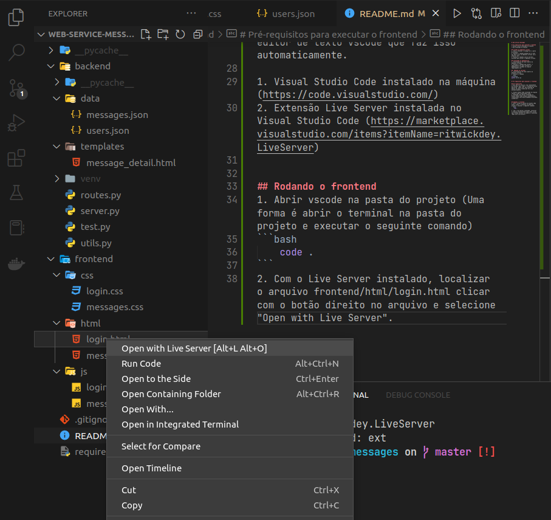

# web service messages

# Pré-requisitos para executar o backend
* Python 3.10.6 instalado na máquina
* pip instalado na máquina

## Criando um ambiente virtual
1. Abra o terminal e navegue até a pasta do projeto.
2. Execute o comando python3.10 -m venv env para criar um ambiente virtual com o nome de "env".
3. Execute o comando source env/bin/activate para ativar o ambiente virtual.

## Instalando as dependências
1. Certifique-se de estar dentro do ambiente virtual.
2. Execute o comando pip install -r requirements.txt para instalar as dependências listadas no arquivo requirements.txt.

##  Rodando ao servidor
1. Certifique-se de estar dentro do ambiente virtual.
2. Execute o comando
```bash
cd backend
python server.py
```

# Pré-requisitos para executar o frontend

## Pré-requisitos
* Para não ser preciso criar manualmente um servidor para rodar o frontend da nossa aplicação, vamos usar uma extensão do editor de texto vscode que faz isso automaticamente.

1. Visual Studio Code instalado na máquina (https://code.visualstudio.com/)
2. Extensão Live Server instalada no Visual Studio Code (https://marketplace.visualstudio.com/items?itemName=ritwickdey.LiveServer)


## Rodando o frontend
1. Abrir vscode na pasta do projeto (Uma forma é abrir o terminal na pasta do projeto e executar o seguinte comando)
```bash
    code .
```
2. Com o Live Server instalado, localizar o arquivo frontend/html/login.html clicar com o botão direito no arquivo e selecione "Open with Live Server".

{ width=50% }


### Pronto, agora podemos acessar nosso frontend por essa URL.
[http://localhost:5500/frontend/html/login.html](http://localhost:5500/frontend/html/login.html)